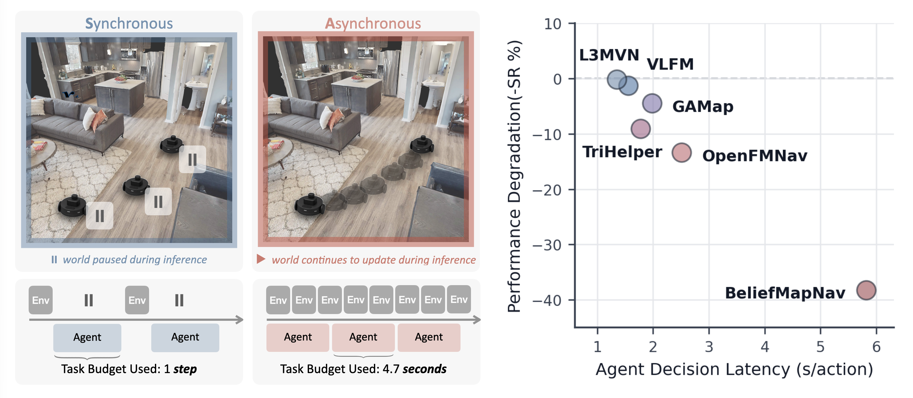

# RTNav: Towards Real-Time Zero-Shot Object Navigation

<div align="center">


<p>
  <a href="https://easoplee.github.io/">Easop Lee</a><sup>*</sup>,
  <a href="https://lingyu98.github.io/">Lingyu Zhang</a><sup>*</sup>, and
  <a href="http://boyuanchen.com/">Boyuan Chen</a><br>
  <small><sup>*</sup>Equal contribution</small><br>
  <em>Duke University &middot; <a href="http://generalroboticslab.com/">General Robotics Lab</a></em>
</p>

**[Project Website](https://generalroboticslab.com/RTNav)**

</div>

<div align="center">
  
</div>

> **Looking for real-world deployment?** See the [RTNav Real-World repository](https://github.com/generalroboticslab/RTNav-RealWorld).

RTNav studies zero-shot object navigation in real-time environments. The simulator continues to step at a constant frequency while the agent computes actions. This repository contains RTNav, a modular, asynchronous navigation agent, and a unified evaluation framework for real-time object navigation, with support for 6 baselines.

## Evaluation & Benchmarking

A unified evaluator is used for all baseline agents and RTNav. Under the hood, it uses a Habitat simulator running at 30 Hz inside a Docker container. Each agent runs in a separate Docker container packaged with its own dependencies. State and action communication between the environment and the agent is enabled through a ROS 2 interface. The method to evaluate can be selected using the `--baseline` argument.

| Agent        | HM3D-v1 | HM3D-v2 | HM3D-OVON |
| ------------ | :-----: | :-----: | :-------: |
| **RTNav**    |    ✓    |    ✓    |     ✓     |
| VLFM         |    ✓    |    ✓    |     ✓     |
| L3MVN        |    ✓    |    ✓    |     -     |
| TriHelper    |    ✓    |    ✓    |     -     |
| GAMap        |    ✓    |    ✓    |     -     |
| OpenFMNav    |    ✓    |    ✓    |     -     |
| BeliefMapNav |    ✓    |    ✓    |     -     |

All baselines support both synchronous and real-time (asynchronous) evaluation. RTNav is designed for asynchronous evaluation only.

## Setup

**1. Prepare data**

Follow the [dataset guide](docs/datasets.md) to download the HM3D-v1, HM3D-v2, and HM3D-OVON scenes and episode datasets. Make sure to set `DATA_DIR`.

**2. Download models**

Download pretrained models required for baselines and RTNav.

* **RTNav:** [download the models used by RTNav](docs/rtnav.md#models).
* **Baselines:** [download the models used by the baselines](docs/baselines.md#checkpoints).

**3. Build Docker images**

Each evaluation uses two containers: `env` runs Habitat, and `agent` runs the selected navigation method. They communicate through ROS 2, while Docker keeps their dependencies isolated.

Build the RTNav images once from the repository root:

```bash
docker build -f docker/Dockerfile.env -t rt-ovn-env:latest .
docker build -f agents/rtnav/docker/Dockerfile -t rt-ovn-agent:latest . # CUDA13
#docker build -f agents/rtnav/docker/Dockerfile.cuda12 -t rt-ovn-agent:latest . # CUDA12
```

Build the shared baseline agent image once, then build the selected baseline.
Replace `vlfm` with `l3mvn`, `trihelper`, `gamap`, `openfmnav`, or
`beliefmapnav`:

```bash
docker build -f docker/Dockerfile.agent -t rt-ovn-agent-base:latest agents
BASELINE=vlfm
docker build -f "agents/baseline_${BASELINE}/Dockerfile" -t "${BASELINE}-agent:latest" .
```

## Evaluation

Run an evaluation from the repository root. Example command:

```bash
DATA_DIR="$DATA_DIR" bash agents/launch_parallel.sh \
  --baseline rtnav \
  --mode async \
  --benchmark hm3d_v2 \
  --episodes 1000 \
  --workers 4 \
  --gpus 0,1,2,3 \
  --launch
```

| Argument | Values | Description |
|---|---|---|
| `--baseline` | `rtnav`, `vlfm`, `l3mvn`, `openfmnav`, `trihelper`, `gamap`, `beliefmapnav` | Method to evaluate. Its agent image must be built first. |
| `--mode` | `async`, `sync` | Evaluation timing mode. RTNav supports `async` only. |
| `--benchmark` | `hm3d_v1`, `hm3d_v2`, `ovon` | Benchmark dataset. Method support is listed above. |
| `--episodes` | Positive integer | Total number of episodes across all workers. |
| `--workers` | Positive integer | Number of parallel simulator-agent pairs. Use `1` for a single pair. |
| `--gpus` | Comma-separated GPU IDs | GPU assigned to each worker; provide at least as many IDs as workers. |
| `--launch` | Flag | Launch immediately. Use `--no-launch` to generate the Compose configuration only. |

`DATA_DIR` must be set to the prepared dataset root. The launcher generates the
required Compose configuration automatically; see [docs/rtnav.md](docs/rtnav.md)
for additional options.

Results across subsets are merged into `agents/rtnav/logs_parallel/live.json`.

**Note:** Real-time evaluation is naturally hardware-dependent. Results reported in our paper were run on an NVIDIA RTX A6000. It is not strictly necessary to use the same hardware for future research; however, baselines should be rerun on the target hardware, and newer methods should be evaluated under the same hardware configuration to ensure fair comparison.

## Citation

```bibtex
@article{lee2026rtnav,
  title   = {{RTNav}: Towards Real-Time Zero-Shot Object Navigation},
  author  = {Lee, Easop and Zhang, Lingyu and Chen, Boyuan},
  journal = {arXiv preprint arXiv:XXXX.XXXXX},
  year    = {2026},
}
```

## Acknowledgement

This work was supported by the DARPA TIAMAT program. We thank the authors of Habitat, OVON, VLFM, L3MVN, TriHelper, GAMap, OpenFMNav, and BeliefMapNav for their open-source research and implementations.
